# Biblioteca - Manual do Usuario

## Indice
1. [Primeiro Acesso](#1-primeiro-acesso)
2. [Dashboard](#2-dashboard)
3. [Livros](#3-livros)
4. [Alunos](#4-alunos)
5. [Gerenciamento de Turmas](#5-gerenciamento-de-turmas)
6. [Emprestimos](#6-emprestimos)
7. [Devolucoes](#7-devolucoes)
8. [Reservas](#8-reservas)
9. [Relatorios](#9-relatorios)
10. [Graficos](#10-graficos)
11. [Backup — Importante!](#11-backup--importante)
12. [Configuracoes da Instituicao](#12-configuracoes-da-instituicao)
13. [Categorias](#13-categorias)
14. [Usuarios e Permissoes](#14-usuarios-e-permissoes)
15. [Perguntas Frequentes](#15-perguntas-frequentes)

---

## 1. Primeiro Acesso

### 1.1 Abrindo o Sistema
- **Windows:** De duplo clique em `Biblioteca.exe`
- **Linux:** De duplo clique no arquivo `.AppImage`
- Aguarde alguns segundos -- o navegador abrira automaticamente
- Se o navegador nao abrir, acesse: `http://127.0.0.1:5477`

### 1.2 Login
- Use o **usuario e senha** fornecidos pelo administrador

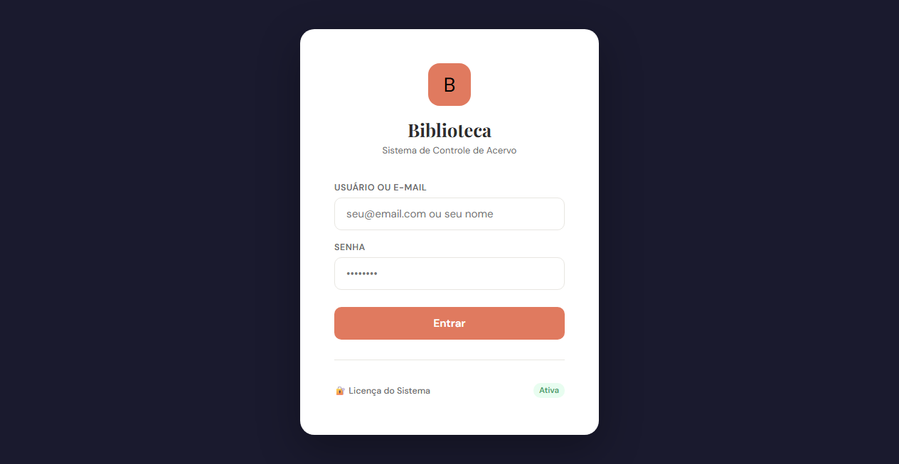

---

## 2. Dashboard

Tela inicial com resumo do sistema:
- **Total de Livros, Alunos, Emprestimos Ativos e Atrasados**
- **Emprestimos Recentes:** lista das ultimas movimentacoes

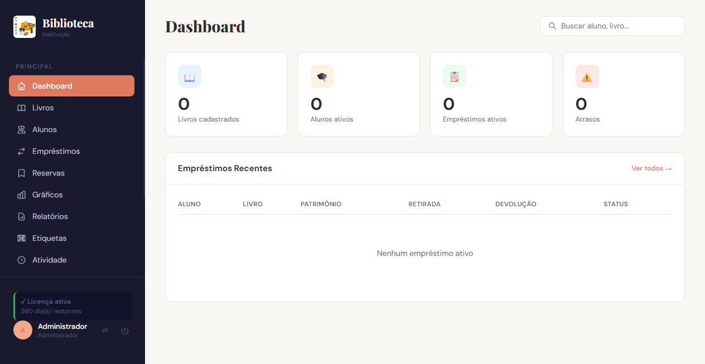

---

## 3. Livros

### 3.1 Buscar Livros
Use o campo de busca para pesquisar por patrimonio, titulo ou autor.

### 3.2 Cadastrar Novo Livro
1. Clique em **"Novo Livro"**
2. Preencha:
   - **Patrimonio:** numero de identificacao (obrigatorio)
   - **Titulo:** nome do livro (obrigatorio)
   - **Autor, ISBN, Categoria, Editora, Ano** (opcionais)
3. Clique em **"Salvar"**

### 3.3 Editar / Remover
- **Editar:** clique no icone de lapis
- **Remover:** clique no icone de lixeira (apenas se sem emprestimos ativos)

### 3.4 Etiqueta de Codigo de Barras
Clique no icone de **codigo de barras** ao lado do livro para imprimir.

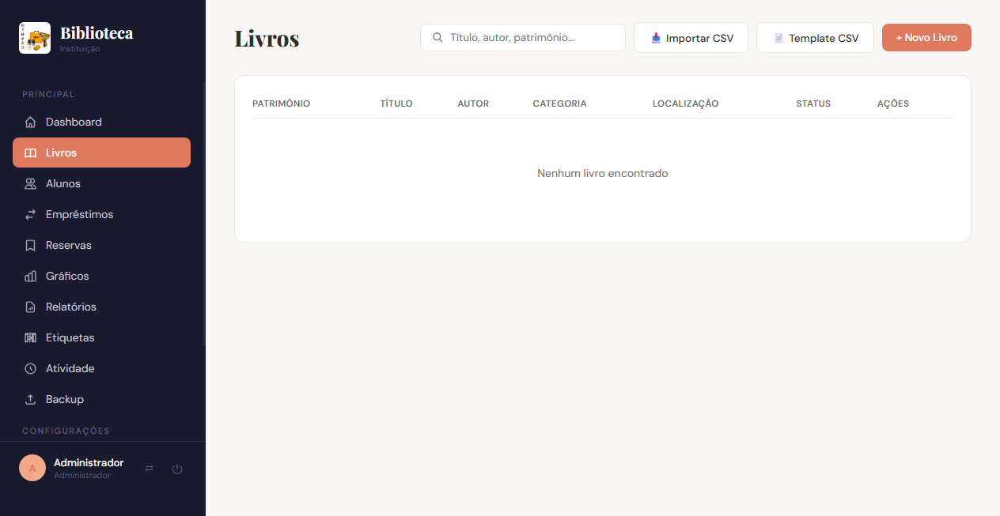

---

## 4. Alunos

### 4.1 Buscar Alunos
Pesquise por nome, matricula ou turma.

### 4.2 Cadastrar Novo Aluno
1. Clique em **"Novo Aluno"**
2. Preencha:
   - **Matricula:** numero de identificacao (obrigatorio)
   - **Nome:** nome completo (obrigatorio)
   - **Turma, Telefone, E-mail** (opcionais)
3. Clique em **"Salvar"**

### 4.3 Status do Aluno
- **Regular** (verde): sem pendencias
- **Pendencia** (vermelho): emprestimo em atraso
- **Inativo** (cinza): aluno desativado

### 4.4 Ativar / Desativar
- Use o filtro "Ativos / Inativos / Todos"
- Clique no botao na coluna Acoes
- Alunos com emprestimos ativos nao podem ser desativados

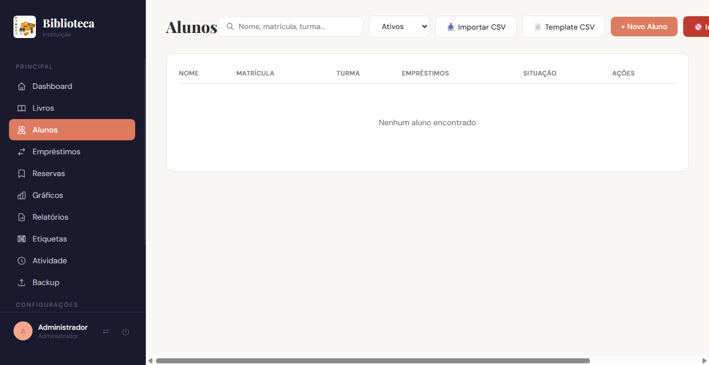

---

## 5. Gerenciamento de Turmas

### 5.1 Inativar Turma Inteira
1. Clique em **"Inativar Turma"**
2. Selecione a turma no menu
3. Confirme para desativar todos os alunos daquela turma

### 5.2 Migracao em Lote (Editar Turma)
Ideal para mudanca de ano letivo:
1. Clique em **"Editar Turma"**
2. Selecione a **Turma de Origem**
3. Para cada aluno, defina a nova turma no campo "Vai para"
4. Marque **"Inativar"** para alunos que nao continuarao
5. Clique em **"Salvar Todas"**

---

## 6. Emprestimos

### 6.1 Novo Emprestimo
1. Va em **Emprestimos** e clique em **"Novo Emprestimo"**
2. **Selecione o Aluno:** digite nome ou matricula
3. **Adicione os Livros:**
   - **Scanner:** leia o codigo de barras
   - **Manual:** busque por titulo, autor ou patrimonio
   - Os livros vao para um carrinho (adicione quantos quiser)
4. **Prazo:** 7, 14, 21, 30 dias ou data personalizada
5. Clique em **"Finalizar Emprestimos"**

### 6.2 Renovacao
- Clique em **"Renovar"** na lista de emprestimos
- O prazo e estendido pelo mesmo numero de dias
- Nao e possivel renovar se outro aluno tiver reserva

### 6.3 Visualizar Atrasados
Use o filtro **"Atrasados"** para ver livros fora do prazo.

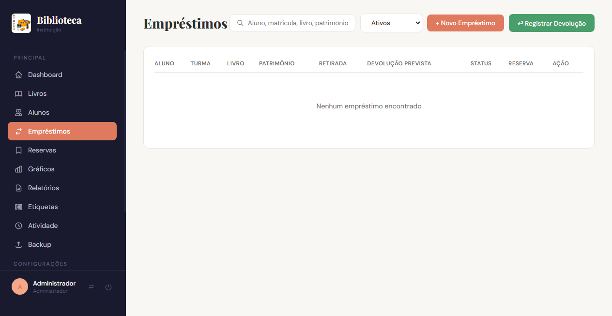

---

## 7. Devolucoes

**Metodo 1 — Botao "Devolver":**
Na lista, clique em **"Devolver"** no emprestimo desejado.

**Metodo 2 — Registrar Devolucao:**
1. Clique em **"Registrar Devolucao"**
2. Escaneie ou digite o numero de patrimonio
3. A devolucao e registrada

Se houver reserva, o sistema avisara: "Reservado por [aluno]".

---

## 8. Reservas

### 8.1 Criar Reserva
No modal de **Novo Emprestimo**, busque um livro ja emprestado e clique em **"Reservar"**.

### 8.2 Visualizar e Cancelar
Va em **Reservas** para ver as reservas ativas. Use **Emprestar** para criar o emprestimo direto da reserva (respeita a fila de reservas). Clique em **Cancelar** para cancelar.

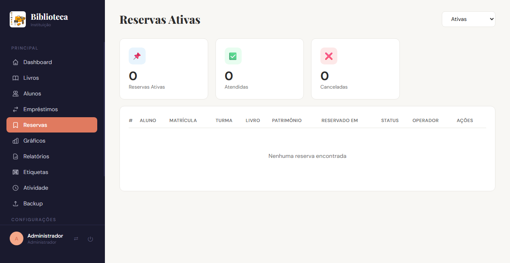

---

## 9. Relatorios

| Relatorio | Para que serve |
|-----------|---------------|
| **Emprestimos Ativos** | Ver o que esta emprestado agora |
| **Emprestimos Atrasados** | Cobrancas e lembretes |
| **Historico de Aluno** | Tudo que um aluno ja pegou |
| **Movimentacao** | Emprestimos e devolucoes em um periodo |
| **Inventario** | Acervo completo por categoria |
| **Mais Emprestados** | Top 20 livros |
| **Ranking de Alunos** | Quem mais leu |
| **Ranking de Turmas** | Turmas que mais leem |

Todos podem ser impressos com o botao **"Imprimir"**.

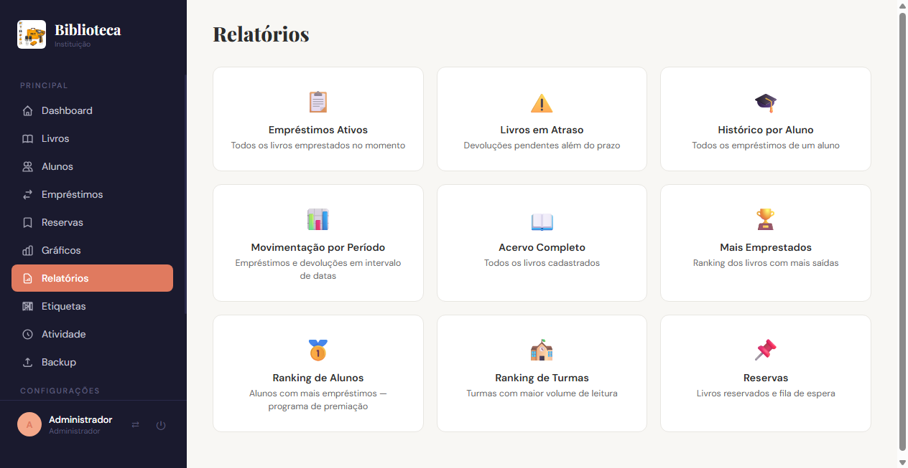

---

## 10. Graficos

Pagina com graficos do movimento da biblioteca:
- Emprestimos por dia (30 dias)
- Livros por categoria
- Livros mais emprestados
- Emprestimos por turma

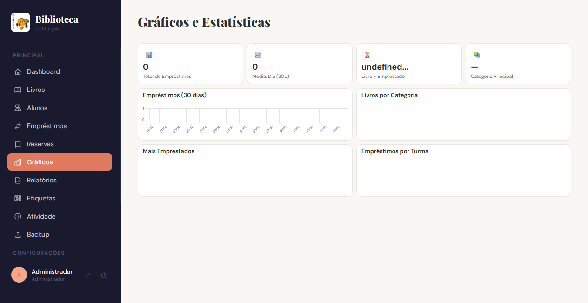

---

## 11. Backup — Importante!

Fazer backup dos dados e **essencial** para nao perder o cadastro de livros, alunos e historico de emprestimos. Existem duas formas:

### 11.1 Backup Automatico (Local)

Ao clicar em **Sair**, o sistema salva automaticamente uma copia do banco de dados na pasta de backups do computador. As **3 copias mais recentes** ficam disponiveis na pagina de Backup com um botao **"Restaurar"** ao lado de cada uma.

**Atencao:** O backup local fica no mesmo computador que o sistema. Se o computador queimar, for roubado ou o disco rigido falhar, **o backup local sera perdido junto com o sistema**.

### 11.2 Backup na Nuvem (Recomendado)

O backup na nuvem envia uma copia dos dados para o **Google Drive** (ou outro servico de nuvem). Assim, mesmo que o computador seja perdido, os dados estarao salvos.

**Vantagens:**
- Protecao contra falha de hardware, roubo ou incendio
- Pode ser acessado de qualquer lugar
- Nao ocupa espaco no computador da biblioteca

**Como configurar (o administrador deve fazer):**
1. Instale o **rclone** (https://rclone.org)
2. Configure o Google Drive: `rclone config create gdrive drive`
3. Apos configurado, aparecera o botao **"Enviar para Nuvem"** na pagina de Backup
4. Clique no botao para enviar o backup para a nuvem

> **Dica:** Faca backup local diariamente e backup na nuvem semanalmente (ou sempre que houver muitas alteracoes).

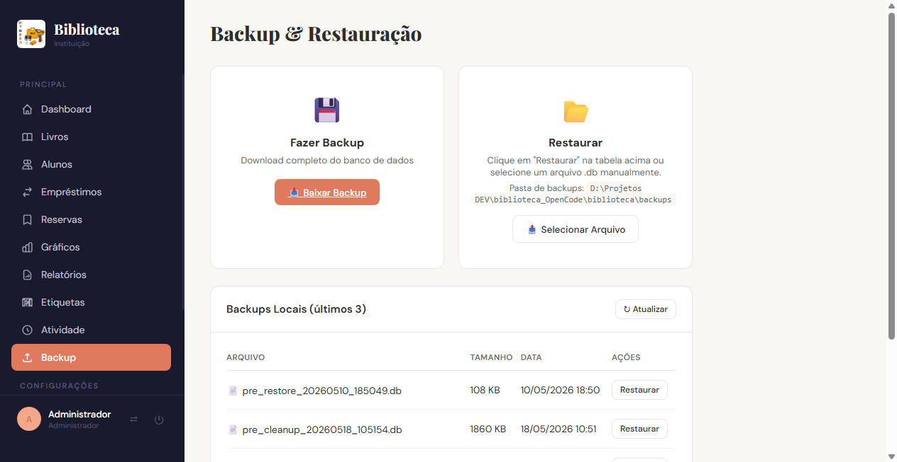

---

## 12. Configuracoes da Instituicao

Va em **Instituicao** (apenas admin) para:
- Alterar nome, CNPJ, endereco, telefone e e-mail da escola
- Fazer upload da logo (aparece nos relatorios impressos)

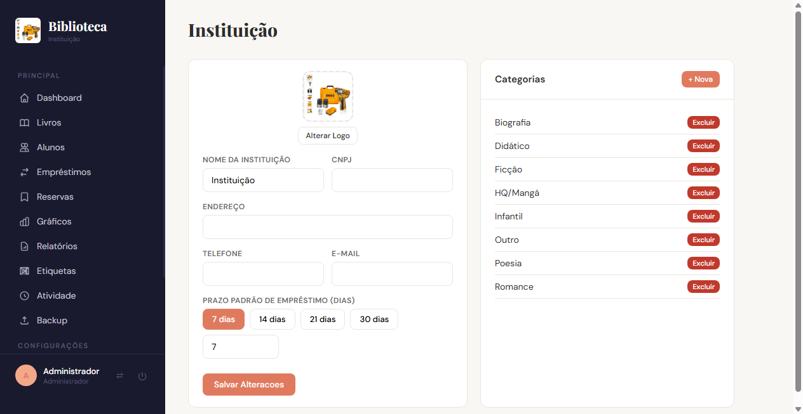

---

## 13. Categorias

Va em **Categorias** para gerenciar as categorias dos livros e definir o prazo padrao de emprestimo
(em dias) para cada uma. O sistema ja vem com 56 categorias pre-cadastradas.

---

## 14. Usuarios e Permissoes

### 14.1 Perfis
- **Admin:** acesso total ao sistema
- **Operador:** acesso limitado as permissoes definidas pelo admin

### 14.2 Gerenciar (Admin)

### 14.3 Trocar Senha
Cada usuario pode trocar a propria senha na pagina de Usuarios.

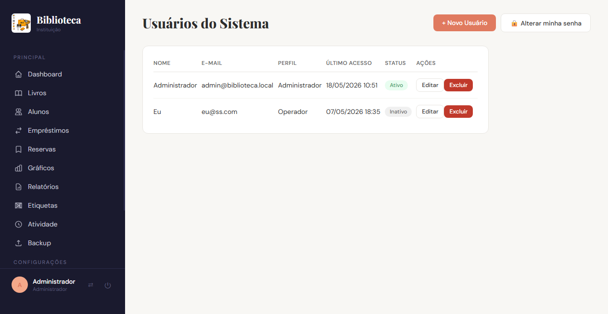

---

## 15. Perguntas Frequentes

### Preciso de internet para usar?
Nao. O sistema funciona 100% offline, localmente.

### O navegador nao abre?
Acesse manualmente: `http://127.0.0.1:5477`

### Como recuperar dados perdidos?
Se houver backup na nuvem, faca o download do arquivo `.db` e use **"Restaurar Backup"** na pagina de Backup. Por isso e importante manter backup na nuvem atualizado.

### Posso usar leitor de codigo de barras?
Sim. Funciona nos campos de patrimonio e na devolucao.

### Onde ficam os dados?
- **Windows:** `%APPDATA%/Biblioteca/`
- **Linux:** `~/.local/share/Biblioteca/`

### Como sair?
Clique em **Sair** no canto inferior esquerdo. O sistema faz backup automatico e desliga.

---

**Versao:** 1.0.29  
**Ultima atualizacao:** 25/05/2026
